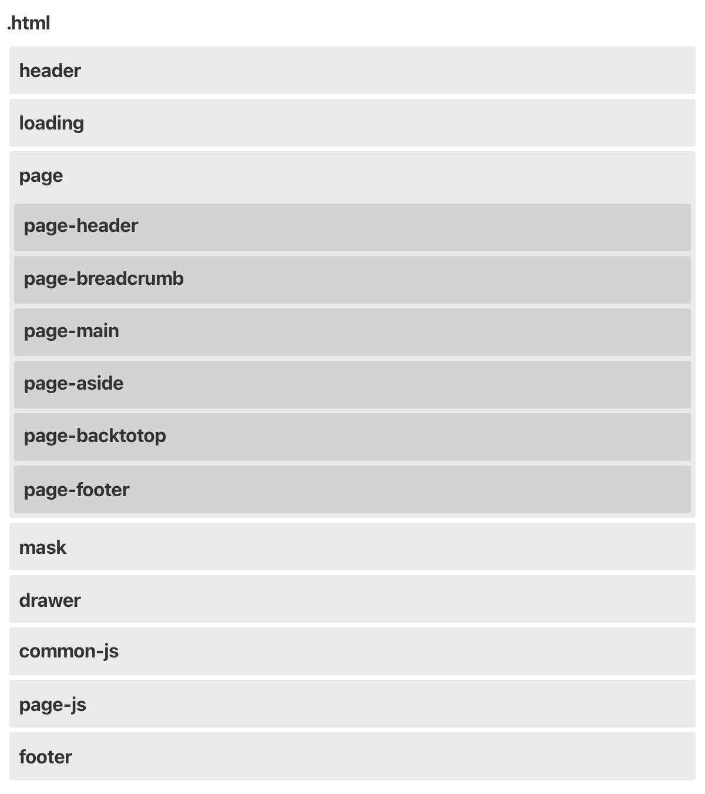

# 前提

- レスポンシブデザイン
- jQuery(3.5) をベース
- 企業サイトなどシンプルな情報発信系サイト
- フォントは `Noto Sans JP` を使う。

# ディレクトリ

- /assets/css/style.css 全てのスタイルを記載するスタイルシート
- /assets/js/library jQuery等、サードパーティのJavaScript
- /assets/js/common 複数ページで使うJavaScript
- /assets/js/page ページの種類別のJavaScript

# ページ構造

.html ファイルは以下の構造を持たせる。

- header
- loading
- page
- mask
- drawer
- common-js
- page-js
- footer