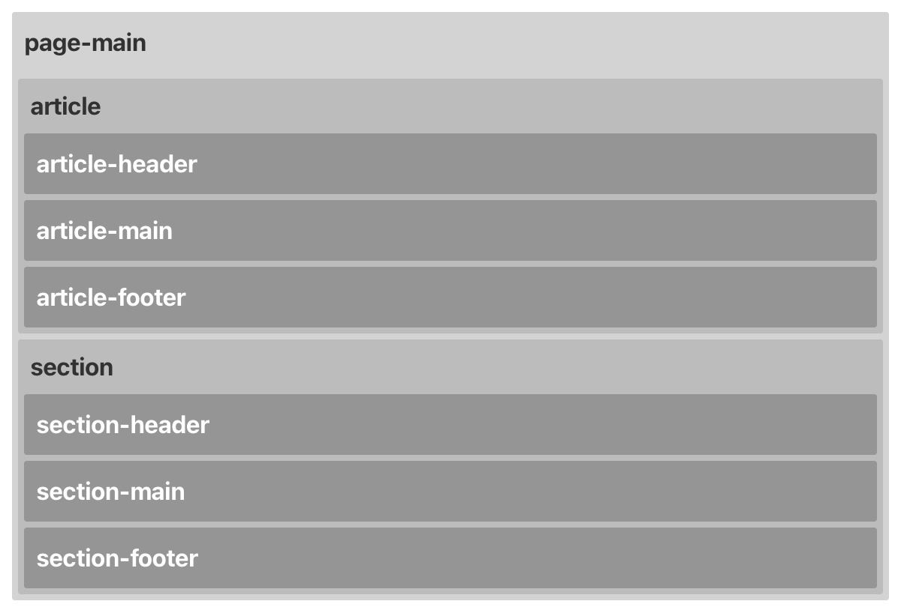

# page-main

`page-main` には `article` と `section` を入れることができる。



`page-main` 内で `section` を2段組みにしたい場合は、下記のように、`.row` で挟む。

  ```html
  <main id="page-main" class="page-main">
    <div class="page-main-container">
        <div class="row">

            <section></section>

            <section></section>

        </div>
    </div>
</main>
  ```